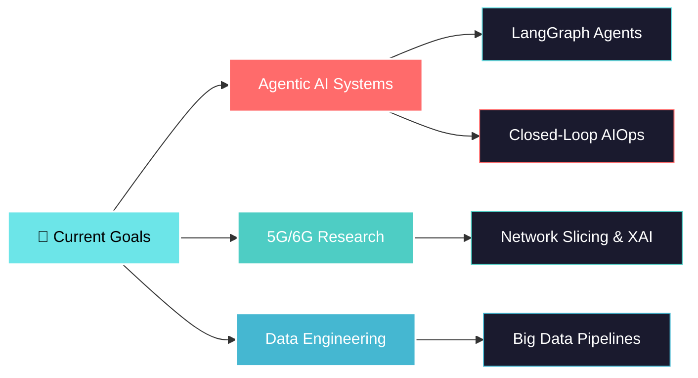

<div align="center">


<a href="https://git.io/typing-svg">
  
</a>

<br/>

[](https://www.linkedin.com/in/mohamed-dhia-chaouachi-643a842a9/)
[](mailto:mohameddhiachaouachi2003@gmail.com)
[](https://github.com/Dhiac7)
[](https://github.com/Dhiac7)

</div>

---

## 🧑‍💻 About Me

```python
class MohamedDhia:
    def __init__(self):
        self.name      = "Mohamed Dhia Chaouachi"
        self.location  = "Tunis, Tunisia 🇹🇳"
        self.education = "ESPRIT Engineering School — Computer Engineering"
        self.focus     = ["Agentic AI & Multi-Agent Systems", "5G/6G Networks", "Data Engineering"]
        self.open_to   = "Research Collaborations & Innovative Projects"

        self.daily_stack = {
            "morning"  : "☕ Coffee + Papers on AI for Telecom",
            "afternoon": "💻 Building Agents & Network Pipelines",
            "evening"  : "📡 Simulating 5G/6G Environments",
            "night"    : "🌙 Open Source & Research Writing"
        }

        self.philosophy = "Autonomous systems that adapt, decide, and act — that's the future I'm building. 🚀"

    def languages(self):
        return ["Arabic 🇹🇳", "French 🇫🇷", "English 🇬🇧"]
```

---

## 🎯 Current Focus



---

## 💻 Tech Arsenal

<div align="center">

### 🎯 Core Languages


### 🤖 AI / ML & Agentic Systems


### 📡 Networks & Telecom


-FF4500?style=for-the-badge)


### 🗄️ Data Engineering & Databases


### ⚙️ Backend & APIs


### 🖥️ Frontend


### ☁️ DevOps & Infrastructure


</div>

---

## 📊 GitHub Analytics

<div align="center">


</div>

---

## 🏆 Achievements

<div align="center">


<br/>


</div>

---

## 🐍 Contribution Snake

<div align="center">

<picture>
  <source media="(prefers-color-scheme: dark)" srcset="https://raw.githubusercontent.com/Dhiac7/Dhiac7/output/github-contribution-grid-snake-dark.svg" />
  <source media="(prefers-color-scheme: light)" srcset="https://raw.githubusercontent.com/Dhiac7/Dhiac7/output/github-contribution-grid-snake.svg" />
  
</picture>

</div>

---

## 📜 Certifications

<div align="center">

| Issuer | Certification |
|:------:|:-------------|
| 🟢 **NVIDIA** | Deep Learning & Generative AI |
| 🟢 **NVIDIA** | Transformer-Based NLP |
| 🟢 **NVIDIA** | Prompt Engineering |
| 🟢 **NVIDIA** | Building RAG Agents with LLMs |
| 🟢 **NVIDIA** | Rapid Application Development with LLMs |
| 🔵 **Samsung Innovation Campus** | Artificial Intelligence Course |

</div>

---

## 💭 Dev Quote

<div align="center">


</div>

---

<div align="center">

### 🤝 Let's Build Something Together

> *I'm always open to collaborating on AI, Telecom & Data Engineering projects.*
> *Whether it's research, open source, or a wild idea — reach out!*

[](https://www.linkedin.com/in/mohamed-dhia-chaouachi-643a842a9/)
[](mailto:mohameddhiachaouachi2003@gmail.com)

<br/>

**"The best way to predict the future is to build it — one agent at a time."**


</div>
