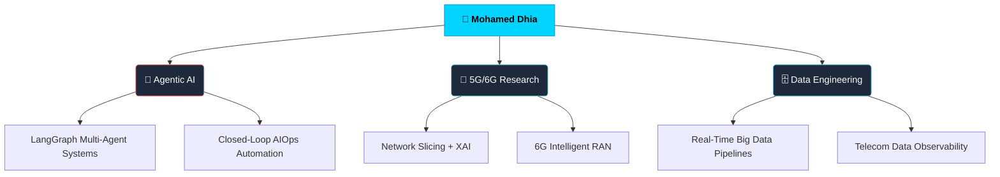

<div align="center">


<a href="https://git.io/typing-svg">
  
</a>

<br/>

[](https://www.linkedin.com/in/mohamed-dhia-chaouachi-643a842a9/)
[](mailto:mohameddhiachaouachi2003@gmail.com)
[](https://github.com/Dhiac7)
[](https://github.com/Dhiac7)

</div>

---

## `> whoami`

```python
class MohamedDhia:
    name       = "Mohamed Dhia Chaouachi"
    location   = "Tunis, Tunisia 🇹🇳"
    school     = "ESPRIT Engineering School — Computer Engineering"
    languages  = ["Arabic 🇹🇳", "French 🇫🇷", "English 🇬🇧"]

    focus = [
        "Agentic AI & Multi-Agent Systems",
        "5G / 6G Network Intelligence",
        "Data Engineering & AIOps",
    ]

    looking_for = "Research Collaborations & Innovative Projects"

    philosophy  = """
        Autonomous systems that observe, reason, and act —
        not just predict. That's the future I'm building.
    """
```

---

## `> tech --stack`

<div align="center">

### Core Languages


### AI · ML · Agentic Systems


### Networks & Telecom

-e84545?style=flat-square)


### Data Engineering & Big Data


### Backend · Frontend · DevOps


</div>

---

## `> current --focus`



---

## `> certifications --list`

<div align="center">

| Badge | Certification | Issuer |
|:-----:|--------------|:------:|
| 🟢 | Deep Learning & Generative AI | **NVIDIA** |
| 🟢 | Transformer-Based NLP | **NVIDIA** |
| 🟢 | Prompt Engineering | **NVIDIA** |
| 🟢 | Building RAG Agents with LLMs | **NVIDIA** |
| 🟢 | Rapid Application Development with LLMs | **NVIDIA** |
| 🔵 | Artificial Intelligence Course | **Samsung Innovation Campus** |

</div>

---

## `> github --stats`

<div align="center">


</div>

---

## `> achievements --all`

<div align="center">

<table>
  <tr>
    <td align="center" width="200">
      <br/>
      <strong style="font-size:28px">246+</strong><br/>
      <sub>Total Commits</sub>
    </td>
    <td align="center" width="200">
      <br/>
      <strong style="font-size:28px">87</strong><br/>
      <sub>Pull Requests</sub>
    </td>
    <td align="center" width="200">
      <br/>
      <strong style="font-size:28px">1+</strong><br/>
      <sub>Stars Earned</sub>
    </td>
    <td align="center" width="200">
      <br/>
      <strong style="font-size:28px">10+</strong><br/>
      <sub>Public Repositories</sub>
    </td>
  </tr>
</table>

</div>

---

## `> pinned --projects`

<div align="center">

[](https://github.com/Dhiac7/LLM-Conversational-Agent-Evaluator)
[](https://github.com/Dhiac7/EduQuill_RAG_Pipeline)

</div>

---

<div align="center">

*"The best way to predict the future is to build it — one agent at a time."*

**[Dhiac7](https://github.com/Dhiac7)** · Open to collabs in AI, Telecom & Data 🤝


</div>
