<div align="center">


<a href="https://git.io/typing-svg">
  
</a>

<br/>

[](https://www.linkedin.com/in/mohamed-dhia-chaouachi-643a842a9/)
[](mailto:mohameddhiachaouachi2003@gmail.com)
[](https://github.com/Dhiac7)
[](https://github.com/Dhiac7)

</div>

---

## `$ whoami`

```python
class MohamedDhia:
    def __init__(self):
        self.name      = "Mohamed Dhia Chaouachi"
        self.location  = "Tunis, Tunisia 🇹🇳"
        self.education = "ESPRIT Engineering School — Computer Engineering"
        self.focus     = [
            "Agentic AI & Multi-Agent Systems",
            "5G/6G Network Intelligence",
            "Data Engineering & AIOps"
        ]
        self.open_to   = "Research Collaborations & Innovative Projects"
        self.languages = ["Arabic 🇹🇳", "French 🇫🇷", "English 🇬🇧"]

    @property
    def daily_stack(self) -> dict:
        return {
            "08:00": "☕ Coffee + arXiv papers on AI for Telecom",
            "10:00": "💻 Building LangGraph agents & network pipelines",
            "15:00": "📡 Simulating 5G/6G slicing environments",
            "21:00": "🌙 Open source contributions & research writing",
        }

    def __repr__(self):
        return (
            "Autonomous systems that adapt, decide, and act "
            "at the speed of the network — that's the future I'm building. 🚀"
        )
```

---

## `$ cat focus.md`

```mermaid
graph TD
    ROOT(["⚡ Mohamed Dhia"]) --> AI["🤖 Agentic AI"]
    ROOT --> NET["📡 5G/6G Research"]
    ROOT --> DATA["🗄️ Data Engineering"]

    AI --> AG1["LangGraph Multi-Agent Systems"]
    AI --> AG2["Closed-Loop AIOps"]
    AI --> AG3["RAG Pipelines & LLM Fine-tuning"]

    NET --> N1["Network Slicing\n(eMBB / URLLC / mMTC)"]
    NET --> N2["XAI for RAN Optimization"]
    NET --> N3["SDN / NFV / MANO"]

    DATA --> D1["Streaming Pipelines\n(Kafka + Hadoop)"]
    DATA --> D2["Time-Series DBs\n(InfluxDB / TimescaleDB)"]
    DATA --> D3["Knowledge Graphs\n(Neo4j)"]

    style ROOT fill:#6CE5E8,stroke:#fff,stroke-width:3px,color:#000,font-weight:bold
    style AI fill:#FF6B6B,stroke:#fff,color:#fff
    style NET fill:#4ECDC4,stroke:#fff,color:#fff
    style DATA fill:#45B7D1,stroke:#fff,color:#fff
    style AG1 fill:#1a1a2e,stroke:#FF6B6B,color:#ccc
    style AG2 fill:#1a1a2e,stroke:#FF6B6B,color:#ccc
    style AG3 fill:#1a1a2e,stroke:#FF6B6B,color:#ccc
    style N1 fill:#1a1a2e,stroke:#4ECDC4,color:#ccc
    style N2 fill:#1a1a2e,stroke:#4ECDC4,color:#ccc
    style N3 fill:#1a1a2e,stroke:#4ECDC4,color:#ccc
    style D1 fill:#1a1a2e,stroke:#45B7D1,color:#ccc
    style D2 fill:#1a1a2e,stroke:#45B7D1,color:#ccc
    style D3 fill:#1a1a2e,stroke:#45B7D1,color:#ccc
```



---

## `$ ls projects/`

> 🚧 *Highlighted work — more in my repositories tab*

| # | Project | Stack | Domain |
|---|---------|-------|--------|
| 🔴 | **Agentic AIOps Platform** — Closed-loop network anomaly detection & self-healing via LangGraph agents | `LangGraph` `FastAPI` `InfluxDB` `Kafka` | 5G AIOps |
| 🟠 | **5G Network Slice Optimizer** — XAI-driven dynamic resource allocation across eMBB/URLLC/mMTC slices | `Python` `scikit-learn` `SHAP` `Neo4j` | 5G/6G |
| 🟡 | **Telecom RAG Assistant** — LLM-powered Q&A over 3GPP specs & network logs with retrieval-augmented generation | `LangChain` `ChromaDB` `FastAPI` `Ollama` | LLM + Telecom |
| 🟢 | **Real-Time Network KPI Dashboard** — Streaming pipeline from network probes to live Grafana visualizations | `Kafka` `TimescaleDB` `Grafana` `Docker` | Data Engineering |

---

## `$ tech --list-all`

<div align="center">

### Languages


### AI · ML · Agentic Systems


### Networks · Telecom


### Data Engineering · Databases


### Backend · APIs


### Frontend


### DevOps · MLOps · Cloud


</div>

---

## `$ git log --stats`

<div align="center">


</div>

---

## `$ cat achievements.log`

<div align="center">


<br/>


</div>

---

## `$ watch contribution-snake`

<div align="center">

<picture>
  <source media="(prefers-color-scheme: dark)" srcset="https://raw.githubusercontent.com/Dhiac7/Dhiac7/output/github-contribution-grid-snake-dark.svg" />
  <source media="(prefers-color-scheme: light)" srcset="https://raw.githubusercontent.com/Dhiac7/Dhiac7/output/github-contribution-grid-snake.svg" />
  
</picture>

</div>

---

## `$ cat certifications.json`

<div align="center">

```json
{
  "certifications": [
    { "issuer": "NVIDIA",                   "title": "Deep Learning & Generative AI",           "status": "✅" },
    { "issuer": "NVIDIA",                   "title": "Transformer-Based NLP",                   "status": "✅" },
    { "issuer": "NVIDIA",                   "title": "Prompt Engineering",                      "status": "✅" },
    { "issuer": "NVIDIA",                   "title": "Building RAG Agents with LLMs",           "status": "✅" },
    { "issuer": "NVIDIA",                   "title": "Rapid Application Development with LLMs", "status": "✅" },
    { "issuer": "Samsung Innovation Campus","title": "Artificial Intelligence Course",           "status": "✅" }
  ]
}
```

</div>

---

## `$ fortune | cowsay`

<div align="center">


</div>

---

<div align="center">

## `$ ping dhia --collaborate`

```
PING dhia.dev (Mohamed Dhia Chaouachi) 56 bytes of data
> Packet 1: AI × Telecom × Data — if it's at that intersection, I'm interested.
> Packet 2: Research proposals, open source, wild ideas: all welcome.
> Packet 3: Average response time < 24h ✅
--- dhia.dev ping statistics ---
3 packets transmitted, 3 received, 0% packet loss
```

<br/>

[](https://www.linkedin.com/in/mohamed-dhia-chaouachi-643a842a9/)
[](mailto:mohameddhiachaouachi2003@gmail.com)
[](https://github.com/Dhiac7?tab=repositories)

<br/>

> **"The best way to predict the future is to build it — one agent at a time."**


</div>
